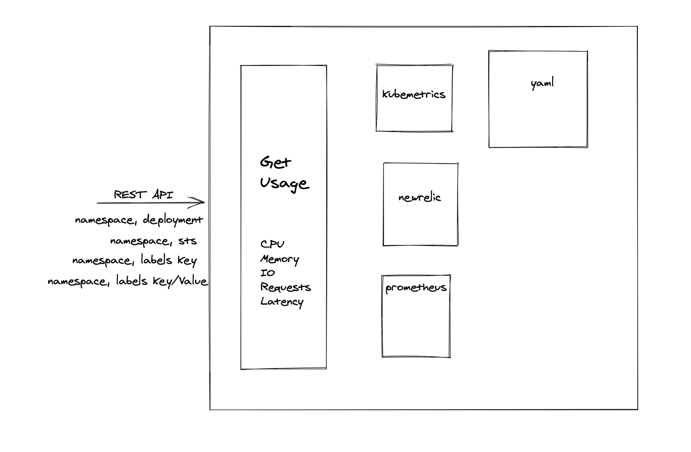

# Introduction
This utility will be used to give consolidate resources utilization for a k8s object such as :
* Deployment
* StatefulSet
* Job
* Replicaset
* Pod

data that can be returned will be
* CPU
* Memory
* IO
* Requests

Integration with below metrics collector will be done:
* kube-metrics
* prometheus
* NewRelic

# Refernce Architecture
